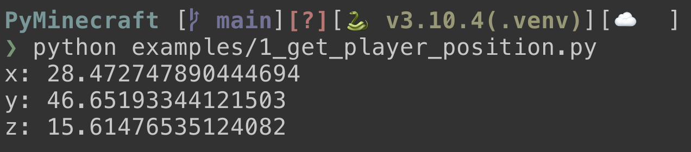

# PyMinecraft

PyMinecraft is a Python library for interacting with Minecraft servers. It includes the `py3minepi` library, which allows you to communicate with the Minecraft server through the plugin `RaspberryJuice.jar`.

## Installation

Before you can use PyMinecraft, you need to install the `py3minepi` library. To do so, create a virtual environment and activate it, then navigate to the `py3minepi` directory and run the following command:

```shell
pip install .
```

This will install the `py3minepi` library and its dependencies.

## Usage

To use PyMinecraft, you first need to start the Minecraft server using the `minecraft_spigot-1.16.1` server included in the repository. The server is self-contained, and you can run it by running the appropriate startup script for your operating system:

- `StartMineCraftServer_1.16.bat` for Windows
- `StartMineCraftServer_1.16.sh` for Linux/MacOS

Once the server is running, you can connect to it using your local installation of Minecraft. Make sure that your Minecraft version is `1.16.1` to ensure compatibility.

PyMinecraft also includes example code in the `examples` directory, which demonstrates how to do interesting things with the Minecraft server using Python. To run the example code, navigate to the `examples` directory and run one of the Python scripts. For example:

### 1_get_player_position.py
```shell
python 1_get_player_position.py
```
This will run the `1_get_player_position.py` script, which shows how to get the position of the player in the Minecraft world.


### 2_set_maze_from_file.py

```shell
python 2_set_maze_from_file.py
```
This will run the `2_set_maze_from_file.py` script, which will generate a maze thats been defined in `examples/assets/maze.txt`


To use the `py3minepi` library in your own Python code, simply import it as follows:

```python
from mcpi.minecraft import Minecraft
```

This will allow you to create a `Minecraft` object, which you can use to interact with the Minecraft server from your Python code.

## License

This project is licensed under the MIT License - see the `LICENSE` file for details.

